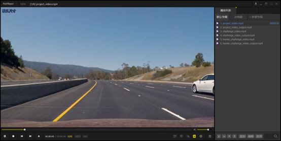
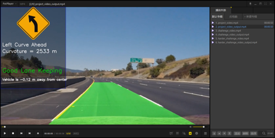
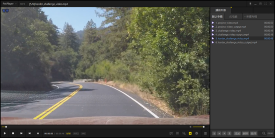
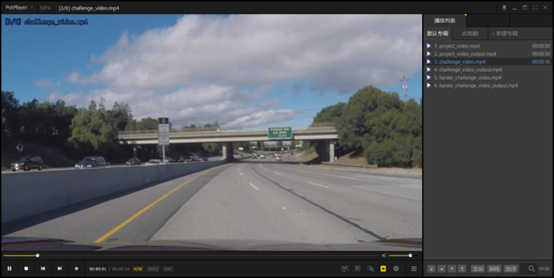
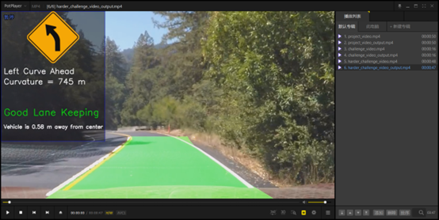
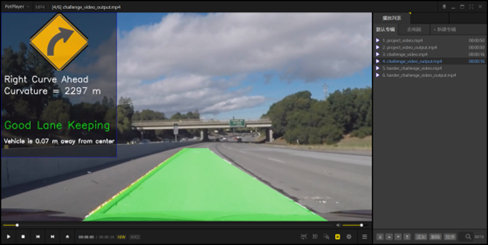
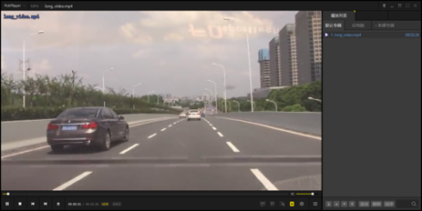
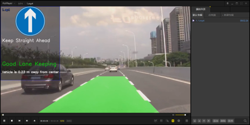
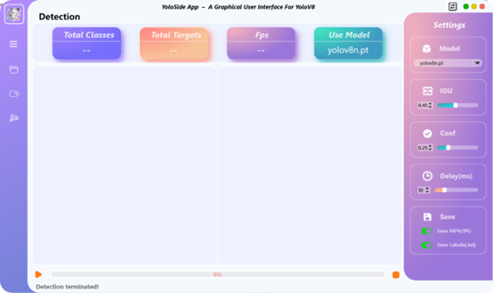
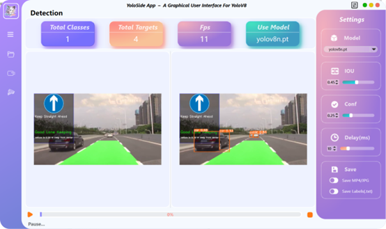

# Advanced Lane Finding

## The Project

The goals / steps of this project are the following:

* Compute the camera calibration matrix and distortion coefficients given a set of chessboard images.
* Apply a distortion correction to raw images.
* Apply a perspective transform to rectify binary image ("birds-eye view").
* Use color transforms, gradients, etc., to create a thresholded binary image.
* Detect lane pixels and fit to find the lane boundary.
* Determine the curvature of the lane and vehicle position with respect to center.
* Warp the detected lane boundaries back onto the original image.
* Output visual display of the lane boundaries and numerical estimation of lane curvature and vehicle position.
* The images for camera calibration are stored in the folder called camera_cal. The images in test_images are for testing your pipeline on single frames.

## Useage
1. set up the environment 
  
        conda env create -f environment.yml
2. To activate the environment:

         conda activate carnd
3. Run the pipeline:

        python main.py INPUT_IMAGE OUTPUT_IMAGE_PATH
        python main.py --video INPUT_VIDEO OUTPUT_VIDEO_PATH
   
# 车道线检测
## 这个项目的目标和步骤如下:

* 根据一组棋盘图像计算相机校准矩阵和畸变系数。
* 对原始图像进行畸变校正。
* 对二值化图像应用透视变换,得到"鸟瞰视图"。
* 利用颜色变换、梯度等方法创建阈值二值化图像。
* 检测车道线像素并拟合得到车道边界。
* 确定车道曲率和车辆相对中心的位置。
* 将检测到的车道边界重新投射到原始图像上。
* 输出显示车道边界的可视化结果,以及车道曲率和车辆位置的数值估计。

相机校准图像存储在名为"camera_cal"的文件夹中,测试图像存储在"test_images"文件夹中。
## 用法
1. 设置环境
  
        conda env create -f environment.yml
2. 激活环境:

         conda activate carnd
3. 运行程序:

        python main.py INPUT_IMAGE OUTPUT_IMAGE_PATH
        python main.py --video INPUT_VIDEO OUTPUT_VIDEO_PATH

# YoloSide ~ A GUI For YoloV8
## Useage
* pip install ultralytics==8.0.48
* pip install pyside6==6.4.2
* python main.py

!! 必须安装相应版本的库

!! 否则会出现如下错误：not enough values to unpack (expected 5, got 4)

!!The corresponding version of the library must be installed

!!Otherwise, the following error will appear:not enough values to unpack (expected 5, got 4)
